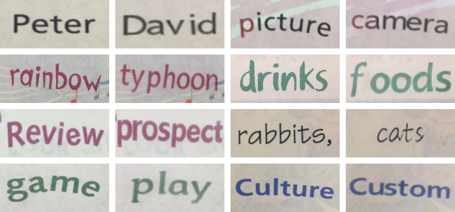
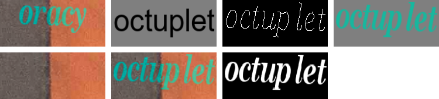

# SRNet - Editing Text in the Wild

&nbsp;
## Introduction
This is a reproducing of paper *Editing Text in the wild* by tensorflow, which aims to replace or modify a word in the source image with another one while maintaining its realistic look.

Original paper: [*Editing Text in the wild*](https://arxiv.org/abs/1908.03047) by Liang Wu, Chengquan Zhang, Jiaming Liu, Junyu Han, Jingtuo Liu, Errui Ding and Xiang Bai.

The model in this project is a result of my experiment and debugging of the details described in the paper.

A pre-trained vgg19 model is used in this SRNet, which is downloaded from [https://github.com/fchollet/deep-learning-models/releases/tag/v0.1](https://github.com/fchollet/deep-learning-models/releases/tag/v0.1) and converted to pb format



&nbsp;
## Prepare data
Data is completely prepared as described in the paper.

You can refer to and improve [Synthtext](https://github.com/ankush-me/SynthText) project to render styled texts on background images. Also need to save some intermediate results as labels while rendering.

According to this paper, you need to prepare 2 input images(i_s, i_t) and 4 label images(t_sk, t_t, t_b, t_f)

- `i_s`: standard text b rendering on gray background

- `i_t`: styled text a rendering on background image

- `t_sk`: skeletonization of styled text b.

- `t_t`: styled text b rendering on gray background

- `t_b`: background image

- `t_f`: styled text b rendering on background image

In my experiment, I found it easier to train with one more label data(mask_t).

- `mask_t`: the binary mask of styled text b



From left to right, from top to bottom are examples of `i_s, i_t, t_sk, t_t, t_b, t_f, mask_t`

&nbsp;
## Train your own dataset
First clone this project
```basrc
$ git clone https://github.com/youdao-ai/SRNet.git
```

Once the data is ready, put the images in different directories with the same name.

You can modify the data directories and training parameters in `cfg.py` as you want.

Then run `python3 train.py` to start training.

&nbsp;
## Predict
You can predict your own data with
```bashrc
$ python3 predict.py --i_s xxx --i_t xxx --save_dir xxx --checkpoint xxx
```
If you want to predict a directory of data, just make sure your data `i_s` and `i_t` have the same prefix and splited by '_', for example, `image1_i_s.png` and `image1_i_t.png`, put them into one directory and
```bashrc
$ python3 predict.py --input_dir xxx --save_dir xxx --checkpoint xxx
```

Or you can set these path information in `cfg.py` and just `python3 predict.py`

&nbsp;
## Requirements
- Python 3.6

- numpy

- opencv-python

- tensorflow 1.14.0

&nbsp;
## Reference
- [Editing Text in the Wild](https://arxiv.org/abs/1908.03047)

- [EnsNet: Ensconce Text in the Wild](https://arxiv.org/abs/1812.00723)

- [Synthetic Data for Text Localisation in Natural Images](https://arxiv.org/abs/1604.06646)

- [A fast parallel algorithm for thinning digital patterns](http://www-prima.inrialpes.fr/perso/Tran/Draft/gateway.cfm.pdf)

